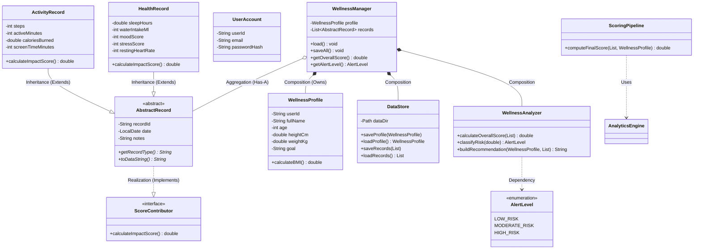

# 🌟 Elite Wellness Monitoring System


> **A comprehensive, local-first Java desktop application for tracking health, building habits, and generating AI-driven wellness insights.**

The **Elite Wellness Monitoring System** is a beautifully designed, object-oriented desktop application built for users who want to take control of their daily health and wellness. It combines health tracking, goal setting, habit formation, and predictive analytics into a single, intuitive interface.

---

## ✨ Features

- **📊 Advanced Dashboard:** Real-time KPI tracking, health scores, and dynamic trend charts.
- **🎯 Goals & Habits Manager:** Track daily habits, build streaks, and manage long-term wellness goals with visual interactive cards.
- **🤖 AI Wellness Assistant:** Built-in simulated chatbot offering personalized health recommendations and alerts based on your data.
- **📈 Predictive Analytics:** Scenario simulators and executive briefs to forecast future health outcomes.
- **💾 Local-First Privacy:** All data (profiles, records, telemetry) is stored securely on your local files using standard Java File I/O.
- **🎨 Modern UI:** A fully animated, responsive, and highly polished Java Swing graphical interface.

---

## 🚀 Getting Started

### Prerequisites
- **Java Development Kit (JDK) 24** or higher
- **Apache Maven** (for building the project)

### Installation & Running

1. **Clone the repository:**
   ```bash
   git clone https://github.com/rashid714/wellness-applcation.git
   cd wellness-applcation
   ```

2. **Build the application:**
   You can easily compile and package the project using the provided scripts:
   ```bash
   bash build.sh
   # This will compile the code, run smoke tests, and generate dist/EliteWellness.jar
   ```

3. **Run the application:**
   ```bash
   java -jar dist/EliteWellness.jar
   ```

*(Alternatively, you can just run `bash run.sh` to compile and launch in one step).*

---

## Enterprise Vision and Mission

### Vision
A professional, enterprise-grade health and fitness analytics platform positioned for global market leadership.

### Mission
Empower individuals and organizations with actionable, secure, and scientifically grounded wellness insights.

### Platform Direction
- Privacy-first architecture
- HIPAA/GDPR-aligned design approach
- Multi-wearable integration-ready APIs
- AI-informed analytics and recommendations

---

## Expanded Key Features

- Multi-Platform Architecture (current project scope):
   - Java Desktop Application (Swing)
   - Optional Web API module (Node.js/Express)
- Wearable Integration Routes (API scaffolding):
   - Fitbit
   - Apple Health
   - Google Fit
   - Garmin
   - Oura
- Advanced Analytics:
   - Weighted wellness scoring
   - Trend analysis
   - Moving average smoothing
   - Scenario simulation
- Security and Governance Orientation:
   - Privacy-first local storage model
   - Audit/telemetry events
   - Compliance-ready architecture patterns
- Subscription and Commercial Model (API module):
   - Free
   - Pro
   - Premium
- Professional UI/UX:
   - Dashboard KPI cards
   - Goal and habit operation boards
   - Assistant and insights workflows
- Cloud Sync Ready:
   - Service abstraction for sync workflows
- Onboarding:
   - Guided setup and goal configuration

---

## Project Architecture Overview

### Desktop Application (Java)

```text
src/wellness/
   Main.java
   model/
      AbstractRecord.java
      HealthRecord.java
      ActivityRecord.java
      UserAccount.java
      WellnessProfile.java
      AlertLevel.java
      ScoreContributor.java
   service/
      AnalyticsEngine.java
      AdvancedAnalytics.java
      WellnessAnalyzer.java
      ScoringPipeline.java
      ContributorRegistry.java
      MovingAverage.java
      AuthService.java
      CloudSyncService.java
      TelemetryService.java
      DataStore.java
      GoalTracker.java
      HabitTracker.java
      MLAnalyticsEngine.java
      DataVisualizationEngine.java
      OnboardingService.java
      PredictiveAnalytics.java
      WellnessBot.java
      WellnessManager.java
      AlertService.java
      AutomationService.java
   ui/
      MainFrame.java
      DashboardPanel.java
      AdvancedInsightsPanel.java
      AIInsightsPanel.java
      GoalsHabitsPanel.java
      ChatbotPanel.java
      LoginDialog.java
      RecordTableModel.java
   test/
      AnalyticsPipelineTest.java
      AnalyticsTest.java
      TelemetryTest.java
```

### Optional Backend API Module (Node.js/Express)

```text
backend/
   src/
      index.js
      routes/
         auth.js
         wellness.js
         wearables.js
         subscription.js
         analytics.js
   package.json
```

---

## Data Structures and Algorithms

### Collections Used
- ArrayList
- HashMap
- LinkedList and list-based queue workflows (where applicable)

### Algorithms and Processing
- Moving average smoothing for trend stabilization
- Weighted scoring across multiple contributors
- Time-series trend evaluation
- Goal progression computation
- Habit streak computation

---

## API Endpoints (Optional Backend Module)

### Authentication
- POST /api/auth/register
- POST /api/auth/login
- POST /api/auth/verify

### Wellness Data
- GET /api/wellness/records
- POST /api/wellness/record
- GET /api/wellness/summary

### Wearable Integration
- POST /api/wearables/fitbit/auth
- GET /api/wearables/apple/auth
- POST /api/wearables/google/auth

### Subscription
- POST /api/subscription/upgrade
- GET /api/subscription/current
- GET /api/subscription/tiers

### Analytics
- GET /api/analytics/trends
- GET /api/analytics/insights
- GET /api/analytics/score

---

## Architecture Highlights

### Scalability
- Modular service design
- Separation of model, service, and UI layers
- API expansion path available

### Security Orientation
- Local-first storage in academic mode
- Telemetry/audit event trail
- Structure prepared for JWT/encryption/compliance expansion

### Performance
- Efficient collection operations
- Lightweight local file persistence
- Incremental analytics refresh

---

## Roadmap and Next Steps

### Phase 1: Foundation (Completed)
- Core models and analytics
- Java GUI workflows
- Goal/habit operations
- Verification and build scripts

### Phase 2: Growth
- Public hardening and wider integrations
- Enhanced AI recommendations

### Phase 3: Scale
- Enterprise analytics and integrations

### Phase 4: Leadership
- Global-grade maturity and expanded platform capabilities

---

## Market Positioning

Target benchmarks:
- Whoop
- Apple Fitness+
- Fitbit Premium

Differentiators:
- Privacy-first architecture
- Strong OOP and modular design
- Report-ready and demo-ready UX
- Academic-grade engineering plus productization path

---
---

# 🎓 Academic Final Project Report
## SDG-Based Object-Oriented Application Development

## 1. Cover Page

Project Title:
- Elite Wellness Monitoring System

Selected SDG:
- SDG 3: Good Health and Well-being


---

## 2. Introduction and SDG Background

This project develops a Java-based GUI application to support healthier daily behavior through tracking, analytics, and guided decisions. The selected SDG is SDG 3 (Good Health and Well-being), which focuses on improving health outcomes and quality of life.

Modern users face common wellness problems such as poor sleep consistency, low activity, dehydration, stress, and lack of structured habit tracking. Existing tools are often fragmented and do not combine profile, records, goals, habits, analytics, and recommendations in one system.

The Elite Wellness Monitoring System addresses this by offering a complete local Java application with data management, score computation, trend analysis, alerting logic, and interactive dashboards.

---

## 3. Problem Statement

Users need a practical system that can:
- Collect health and activity data in one place.
- Track progress against daily and weekly goals.
- Convert records into clear wellness insights.
- Provide consistent habit and recommendation support.
- Persist data between sessions.

Without such a system, users rely on memory or multiple disconnected apps, resulting in low adherence and weak decision-making.

---

## 4. System Objectives

The project objectives are:
- Build a working Java GUI system (Swing-based) for wellness simulation.
- Apply OOP principles correctly: encapsulation, inheritance, polymorphism, abstraction.
- Use collections and file handling for data persistence.
- Implement meaningful processing logic, not only CRUD.
- Provide clear and professional UI output for demonstration.
- Deliver a stable, testable application for final presentation.

---

## 5. Project Scope and Functional Requirements

### 5.1 Included Features
- Authentication and login dialog.
- User profile creation and update.
- Health record and activity record management.
- Dashboard with KPI cards and trend visualizations.
- Goals and habits management (add, update, delete, complete).
- Habit operations board and goal portfolio views.
- AI assistant guidance modes.
- Advanced insights, scenario simulation, and executive brief export.
- Telemetry logging and analytics smoke tests.

### 5.2 Processing and Simulation Logic
- Wellness scoring engine with contributors.
- Trend smoothing and moving average behavior.
- Goal progress computation.
- Habit streak and completion metrics.
- Alert-level logic and recommendation generation.

---

## 6. OOP Design and UML

The system follows layered structure:
- Model layer: domain entities and abstract/base contracts.
- Service layer: business logic, analytics, alerting, automation.
- UI layer: Swing panels, frame orchestration, user workflows.

UML reference:
- See docs/UML_Class_Diagram.md (Mermaid class diagram included).

### 6.1 OOP Principle Mapping

Encapsulation:
- Private fields with controlled access in model classes.
- Validation handled through constructors and setters.

Inheritance:
- AbstractRecord as abstract parent.
- HealthRecord and ActivityRecord extend AbstractRecord.

Polymorphism:
- AbstractRecord references used to process mixed record types at runtime.
- Contributor-oriented score calculation through interface contracts.

Abstraction:
- Abstract base class AbstractRecord.
- Interface ScoreContributor.

---

## 7. Package and Class Breakdown

### 7.1 Java Source Package Structure

Root package:
- wellness

Sub-packages:
- wellness.model
- wellness.service
- wellness.ui
- wellness.test

### 7.2 wellness.model Classes
- AbstractRecord
- ActivityRecord
- AlertLevel
- HealthRecord
- ScoreContributor
- UserAccount
- WellnessProfile

### 7.3 wellness.service Classes
- AdvancedAnalytics
- AlertService
- AnalyticsEngine
- AuthService
- AutomationService
- CloudSyncService
- ContributorRegistry
- DataStore
- DataVisualizationEngine
- GoalTracker
- HabitTracker
- MLAnalyticsEngine
- MovingAverage
- OnboardingService
- PredictiveAnalytics
- ScoringPipeline
- TelemetryService
- WellnessAnalyzer
- WellnessBot
- WellnessManager

### 7.4 wellness.ui Classes
- AIInsightsPanel
- AdvancedDashboardPanel
- AdvancedInsightsPanel
- ChatbotPanel
- DashboardPanel
- GoalsHabitsPanel
- LoginDialog
- MainFrame
- RecordTableModel

### 7.5 wellness.test Classes
- AnalyticsPipelineTest
- AnalyticsTest
- TelemetryTest

### 7.6 Main Entry Point
- wellness.Main

---

## 8. Technology and Dependencies

This submission uses Java only.

- Language: Java
- UI: Java Swing
- Build: Maven (source directory configured as src)
- Java Release: 24
- Persistence: local file handling under data/

---

## 9. Collections and File Handling

Collections used in the Java application:
- ArrayList
- HashMap
- Other standard Java collection constructs in service/UI logic

File handling and persistence:
- User, profile, and records data are persisted in local files.
- Telemetry output is written for testable logging behavior.

This satisfies the assignment requirement for collections and file I/O persistence.

---

## 10. UML Class Diagram (Important Classes)



---

## 11. Implementation Details (Key Workflows)

### 11.1 User Flow
1. User opens app and signs in through LoginDialog.
2. WellnessManager loads existing profile and records from data store.
3. User adds health and activity records through the UI.
4. Dashboard updates KPIs and trends.
5. User manages goals and habits with update/delete/complete actions.
6. Advanced insights panel computes forecasts and scenarios.

### 11.2 Goal and Habit Management
- CRUD operations supported in GoalTracker and HabitTracker.
- UI supports add/update/delete/complete workflows.
- Portfolio and operations views present data in structured visual format.

### 11.3 Analytics and Insights
- Score engine combines profile and record factors.
- Trend analysis and smoothing are displayed in dashboard charts.
- Advanced insights provide scenarios and executive summaries.

---

## 12. Build, Run, and Test

Prerequisites:
- JDK 24
- Maven

Commands:

```bash
# Verify compile + smoke tests
bash verify.sh

# Build release JAR
bash build.sh

# Run application
java -jar dist/EliteWellness.jar
```

Alternative direct run:

```bash
mkdir -p out
find src -name '*.java' -print0 | xargs -0 javac -d out
java -cp out wellness.Main
```

---

## 13. Testing and Sample Output

Observed verification status:
- Compile: PASSED
- Analytics pipeline smoke test: PASSED
- Telemetry smoke test: PASSED

Sample telemetry output (from smoke run):
- Telemetry events written.
- Weighted score: 84.925
- Trend: 25.125

---

## 14. Code Quality and Documentation

Code quality practices applied:
- Modular package structure with clear separation of concerns.
- Consistent naming for classes/methods.
- Services isolate business logic from UI.
- Reusable components for records, tracking, analytics, and visualization.

Documentation included in docs/:
- Product specification
- UML class diagram
- Presentation demo guide
- Features inventory
- Commercialization roadmap
- Security and compliance notes
- Final project report

---

## 15. Team Contribution and Collaboration

Suggested section for final submission (edit with actual details):
- Member 1: Core architecture, service implementation.
- Member 2: UI/UX implementation, dashboard, goals/habits interactions.
- Member 3: Testing, documentation.
- Member 4: goals/habits interactions.
- Member 4: presentation preparation, data layer.

Collaboration approach:
- Shared planning and task division.
- Continuous integration of code changes.
- Joint verification and rehearsal for demo.

---

## 16. Discussion and Limitations

Strengths:
- Functional and stable Java GUI application.
- Strong OOP implementation with practical class relationships.
- Real processing logic for scoring, alerts, trends, and progress.
- Good assignment fit for SDG 3 use case.

Current limitations:
- Local file storage is suitable for course scope but not enterprise-scale.
- Some advanced features are simulation-level, not production cloud deployment.

---

## 17. Future Improvements

Potential next steps:
- Replace local persistence with database-backed storage.
- Add secure cloud sync and multi-device account state.
- Expand recommendation intelligence with more robust AI/ML models.
- Improve role-based access and audit reporting for enterprise mode.
