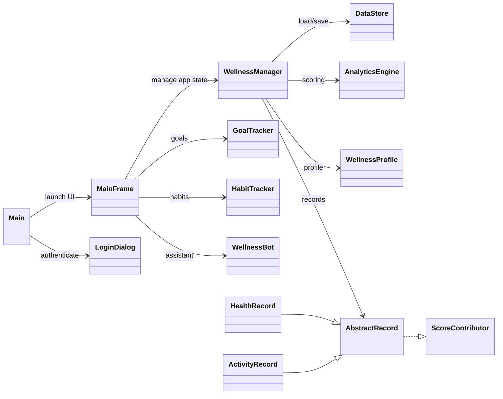

# UML Class Diagram (Important Classes Only)

8. `HealthRecord` and `ActivityRecord` inherit from `AbstractRecord`.
9. `AbstractRecord` implements `ScoreContributor`, enabling polymorphic scoring.
10. `CloudSyncService` and `AuthService` handle synchronization and authentication support.

## 5) Report Usage Notes

- Use the starter diagram first during presentation (easy audience onboarding).
- Then switch to the full diagram for technical depth.
- This version intentionally excludes test classes to keep the architecture readable.
